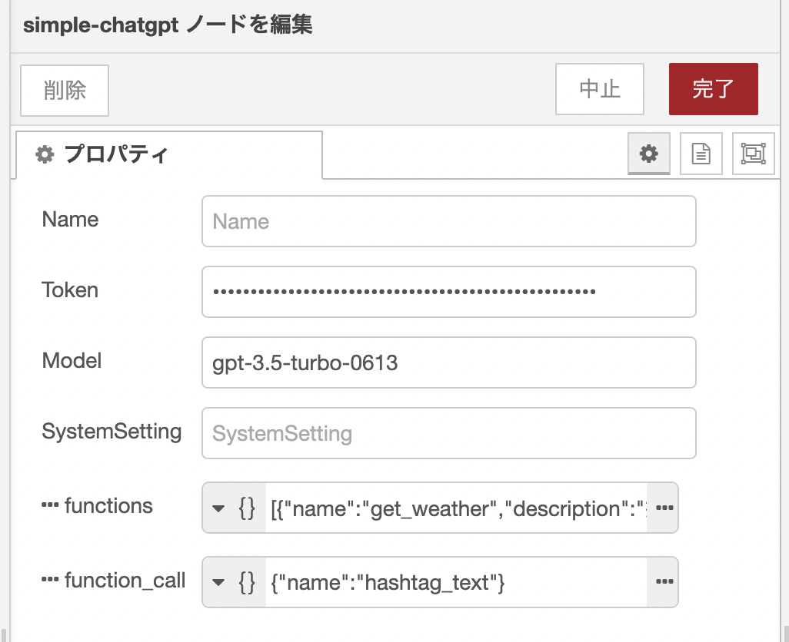

## 概要
payloadの文字列からChatGPTに問い合わせを行います。

## インストール

```
npm i node-red-contrib-simple-chatgpt
```

or

AdminタブからInstall

## 使い方
### 入力項目

|項目|説明|
|--|--|
|Token|OpenAPIのAPIキーを設定します。|
|Model|使用するモデル名を指定します。デフォルトは`gpt-3.5-turbo`です。|
|SystemSetting|AIアシスタントの設定などを記述します。例えば、語尾に必ず「テヘペロ」とつけて等を指定することができます。|
|pastMessages|会話の履歴を渡します。会話を継続する際に必要です。|
|functions|`gpt-3.5-turbo-0613`以降から使えます。指定サンプルは別途。|
|function_call|functionsで指定した関数名を強制実行できます。`auto`とすると自動的に判別して関数が呼ばれます。`none`だと呼ばれません。`{name: 関数名}`を指定すると強制的に対象関数を実行します。|

### 出力項目

|項目|説明|
|--|--|
|payload|ChatGPTの返答が返ってきます。Function実行された場合は`null`が返ります。|
|pastMessages|会話の履歴配列を返します。|
|payloadFunction|FunctionCallingで実行され場合、実行した関数名とJSONパース済みのargumentsが返ります。|

## Functions指定方法
Functionsのサンプルは下記の通りです。配列形式で関数名や関数の詳細、パラメータを指定します。

|項目|説明|
|--|--|
|name|関数の名前。好きな名前を決めることができます。|
|description|関数の詳細説明。ある程度詳細に書くほうが望ましいです。|
|parameters.properties|パラメータの詳細。設定してほしいプロパティ名と型、説明文を記載します。|
|parameters.required|プロパティで返してほしい必須のプロパティ名を指定します。|

```json
[
    {
        "name": "get_weather",
        "description": "指定された場所と日付の天気を取得する",
        "parameters": {
            "type": "object",
            "properties": {
                "location": {
                    "type": "string",
                    "description": "都道府県や市、町の名前, e.g. 東京都文京区"
                },
                "date": {
                    "type": "string",
                    "description": "Date formatted in YYYY/MM/DD, e.g. 2023/06/13"
                }
            },
            "required": [
                "location",
                "date"
            ]
        }
    },
    {
        "name": "recommend_book",
        "description": "おすすめの本を1冊紹介する",
        "parameters": {
            "type": "object",
            "properties": {
                "title": {
                    "type": "string",
                    "description": "本のタイトル"
                },
                "description": {
                    "type": "string",
                    "description": "本の内容"
                }
            },
            "required": [
                "title",
                "description"
            ]
        }
    },
    {
        "name": "hashtag_text",
        "description": "ユーザから与えられたテキストからハッシュタグを出力してください。",
        "parameters": {
            "type": "object",
            "properties": {
                "tag": {
                    "type": "string",
                    "description": "ハッシュタグを最低でも3つ以上出力してください。"
                }
            },
            "required": [
                "tag"
            ]
        }
    }
]
```

指定方法の詳細は[こちら](https://openai.com/blog/function-calling-and-other-api-updates)をご確認ください。

## function_call指定方法
文字列で`auto`か`none`の他に、Jsonオブジェクトで強制的に実行する関数名を指定します。
上記Functionsを与えた場合の例です。`hashtag_text`が強制的に行われるようになります。

```json
{
    "name": "hashtag_text"
}
```

## 設定例




## LINK

* [NodeRED](https://flows.nodered.org/node/node-red-contrib-simple-chatgpt)
* [Libraries.io](https://libraries.io/npm/node-red-contrib-simple-chatgpt)
* [npm](https://www.npmjs.com/package/node-red-contrib-simple-chatgpt)

## release

* 2023/06/23: Function Calling対応（v1.2.0）
* 2023/03/02: ChatGPT API（gpt-3.5-turbo）対応（v1.1.0）
* 2022/12/05: 初回リリース（v1.0.0）

